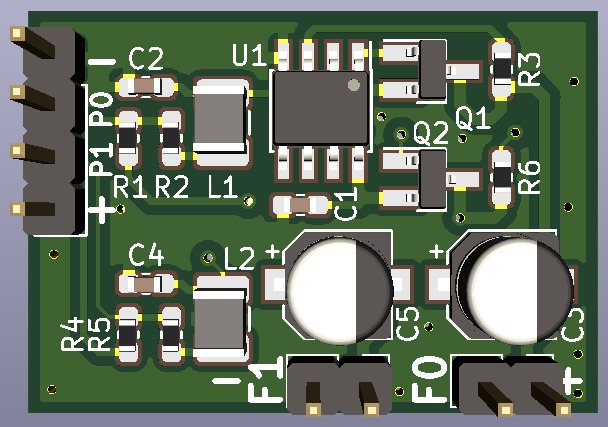
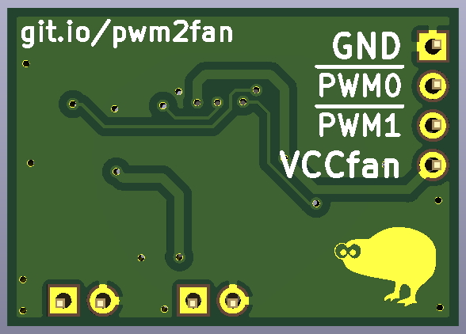

# PWM-to-fan

This is a small board intended to take an open-drain inverted PWM output, and convert it to a DC voltage for a fan. 
This is because many fans do not run well with their main supply PWMed.

The board was made for use with the Duet 3D printer controllers, but will work for any open-drain inverted PWM outputs.

Many thanks to [N2](http://ee.david.promo) who came up with the circuit. 

